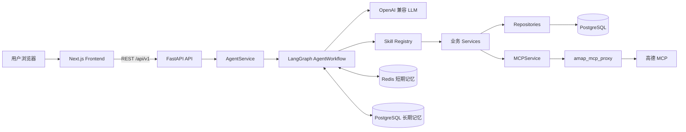
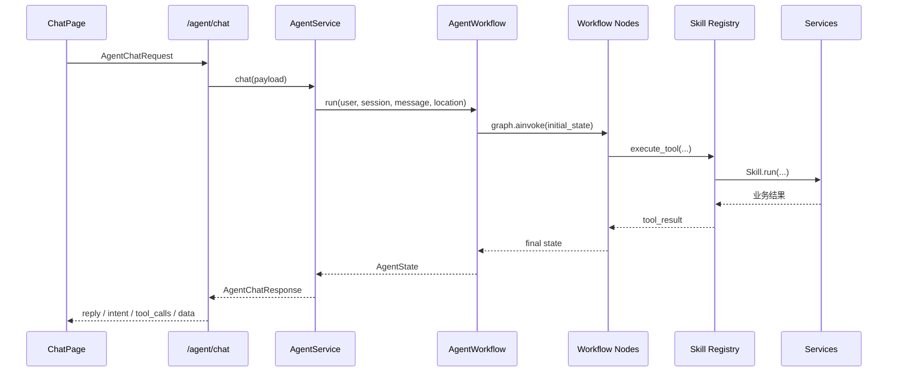
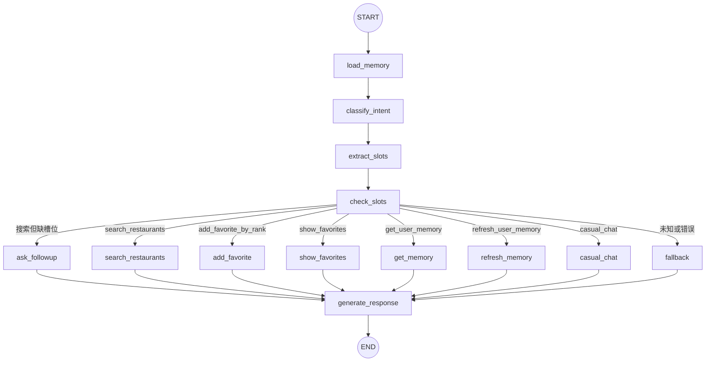
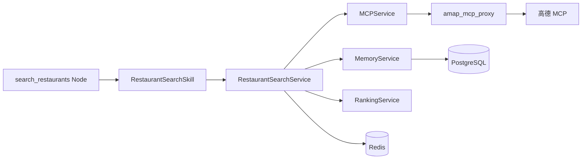

# TasteScout Agent 项目架构与 LangGraph 工作流

本文面向希望阅读、调试或扩展 TasteScout Agent 的开发者。它说明项目各目录的职责、一次请求如何穿过前后端，以及 LangGraph 的 `State`、`Node`、条件路由和 `Graph` 在当前代码中的具体落点。

## 1. 系统全景

TasteScout Agent 由三个可独立启动的应用和两个数据基础设施组成：

- `frontend`：Next.js Web 界面，负责对话、餐厅卡片、地图、收藏和记忆页面。
- `backend`：FastAPI 主服务，负责 API、LangGraph Agent、业务服务和数据访问。
- `amap_mcp_proxy`：把后端的普通 HTTP 请求转换成高德 MCP 工具调用。
- PostgreSQL：保存用户、餐厅、评价、收藏和长期口味记忆。
- Redis：保存会话级短期记忆、待补槽位和最近推荐结果。



前端并非所有操作都经过 Agent。例如收藏夹管理、餐厅详情和评价也可以直接调用对应 REST API；自然语言对话则通过 LangGraph 编排。

## 2. 目录结构

```text
.
├── frontend/
│   ├── app/                    # Next.js App Router 页面
│   │   ├── chat/               # 对话与推荐主页面
│   │   ├── favorites/          # 收藏夹页面
│   │   ├── history/            # 本地对话历史
│   │   ├── memory/             # 长期口味记忆
│   │   ├── restaurants/        # 餐厅详情与评价
│   │   └── settings/           # 用户设置
│   ├── components/             # 对话、地图、餐厅卡片和布局组件
│   ├── hooks/                  # 浏览器定位等 React Hook
│   ├── lib/                    # API Client、类型和工具函数
│   └── stores/                 # Zustand 用户与对话状态
│
├── backend/
│   ├── alembic/                # PostgreSQL 数据库迁移
│   └── app/
│       ├── api/v1/             # FastAPI 路由层
│       ├── workflows/          # LangGraph State、Node、Graph 与规划器
│       ├── agent/              # LLM、规则意图解析、槽位工具和工具门面
│       ├── skills/             # Agent 可执行的业务能力
│       ├── services/           # 餐厅、收藏、记忆、排序等业务逻辑
│       ├── repositories/       # SQLAlchemy 数据访问
│       ├── models/             # SQLAlchemy ORM 模型
│       ├── schemas/            # Pydantic 请求/响应模型
│       ├── memory/             # Redis 短期记忆实现
│       ├── mcp/                # 高德代理客户端与 MCP 数据模型
│       ├── guardrails/         # MCP 结果与数据库写入清洗
│       ├── db/                 # 数据库会话与模型基类
│       └── core/               # 环境变量和应用配置
│
└── amap_mcp_proxy/
    ├── main.py                 # FastAPI 到高德 MCP 的协议适配
    └── config.py               # MCP URL 与超时配置
```

## 3. 后端分层关系

| 层 | 主要目录 | 职责 |
| --- | --- | --- |
| API | `backend/app/api/v1` | 校验 HTTP 输入、注入数据库与 Redis 依赖、返回响应模型 |
| Workflow | `backend/app/workflows` | 用 LangGraph 编排记忆、意图、槽位、工具和回复流程 |
| Agent | `backend/app/agent` | 调用 LLM、规则化识别意图、处理槽位、暴露工具注册门面 |
| Skill | `backend/app/skills` | 把 Agent 意图转换为明确、可执行的业务能力 |
| Service | `backend/app/services` | 实现搜索、排序、收藏、记忆刷新等业务用例 |
| Repository | `backend/app/repositories` | 封装 SQLAlchemy 查询和持久化操作 |
| Model / Schema | `backend/app/models`、`schemas` | 分别描述数据库实体和 API/服务数据结构 |
| Adapter | `backend/app/mcp`、`amap_mcp_proxy` | 隔离外部高德 MCP 协议与业务层 |

这个分层的关键点是：LangGraph 负责“下一步做什么”，Skill 负责“调用哪项业务能力”，Service 和 Repository 负责“具体怎样完成”。

## 4. 一次 Agent 请求的调用链

自然语言对话的主入口是 `POST /api/v1/agent/chat`。



具体文件对应如下：

1. 前端 [`frontend/app/chat/page.tsx`](frontend/app/chat/page.tsx) 通过 API Client 发送 `user_id`、`session_id`、`message`、当前位置和位置文本。
2. [`backend/app/api/v1/agent.py`](backend/app/api/v1/agent.py) 注入 `AsyncSession` 与 `ShortTermMemory`，创建 `AgentService`。
3. [`backend/app/services/agent_service.py`](backend/app/services/agent_service.py) 创建 `AgentWorkflow` 并调用 `run()`。
4. [`backend/app/workflows/agent_workflow.py`](backend/app/workflows/agent_workflow.py) 构造初始 State，使用 `graph.ainvoke()` 执行整张图。
5. 最终 State 被 `AgentService` 映射为对外的 `AgentChatResponse`。

调试时可以调用 `POST /api/v1/workflow/debug-agent`。该接口位于 [`backend/app/api/v1/workflow.py`](backend/app/api/v1/workflow.py)，会直接返回完整 LangGraph State，而不是只返回面向前端的响应模型。

## 5. LangGraph 在项目中的实现

LangGraph 的三个核心概念在本项目中分别对应：

| LangGraph 概念 | 项目实现 |
| --- | --- |
| State | `AgentState`，定义整次图执行共享的数据结构 |
| Node | `AgentWorkflowNodes` 的异步方法，以及它们委托的 Planner/Skill |
| Graph | `AgentWorkflow.build_graph()` 中的节点注册、边和条件路由 |

### 5.1 State：一次图执行的共享上下文

State 定义在 [`backend/app/workflows/agent_state.py`](backend/app/workflows/agent_state.py)：

```python
class AgentState(TypedDict, total=False):
    user_id: str
    session_id: str
    message: str
    # ...
    intent: str | None
    search_slots: dict[str, Any] | None
    missing_slots: list[str]
    tool_result: dict[str, Any] | None
    reply: str | None
```

`total=False` 表示字段在类型层面允许暂时不存在。实际执行时，`AgentWorkflow.run()` 会创建一份包含主要字段默认值的 `initial_state`。每个 Node 不需要返回完整 State，只返回自己负责更新的字段；LangGraph 将这些局部更新合并回共享 State。

State 字段可以按职责分为六组：

| 字段组 | 字段 | 含义与主要写入者 |
| --- | --- | --- |
| 请求身份 | `user_id`、`session_id` | 标识用户和会话，由 `AgentWorkflow.run()` 初始化 |
| 用户输入 | `message`、`location`、`location_label` | 本轮文本和前端定位，由 `AgentWorkflow.run()` 初始化 |
| 意图规划 | `intent`、`llm_parsed_context`、`planned_tool_args` | 由 `IntentPlanner` 生成 |
| 槽位规划 | `llm_slot_plan`、`search_slots`、`missing_slots` | 由 `SearchSlotPlanner` 生成 |
| 记忆 | `short_term_memory`、`long_term_memory`、`memory_used` | 由 `MemoryLoader` 读取 Redis/PostgreSQL 后写入 |
| 执行与输出 | `tool_calls`、`tool_result`、`data`、`reply`、`error` | 由工具节点和 `ResponsePlanner` 写入 |

初始 State 的重要特征是：它只承载本次 HTTP 请求的执行上下文，不等于持久化记忆。跨请求数据由 Redis 和 PostgreSQL 保存，下一次请求再由 `load_memory` 节点重新载入。

### 5.2 Node：对 State 进行局部变换

所有图节点都注册自 [`backend/app/workflows/nodes.py`](backend/app/workflows/nodes.py) 中的 `AgentWorkflowNodes`。这个类是“节点适配层”：简单节点把工作委托给专门 Planner，业务节点统一委托给 Skill Registry。

| 图节点 | 实际方法或组件 | 主要读取 | 主要写入 |
| --- | --- | --- | --- |
| `load_memory` | `MemoryLoader.load()` | 用户、会话 | 短期记忆、长期记忆、`memory_used`、错误 |
| `classify_intent` | `IntentPlanner.plan()` | 输入、位置、记忆 | `intent`、LLM 解析上下文、预备工具参数 |
| `extract_slots` | `SearchSlotPlanner.extract()` | 搜索意图、输入、记忆 | 搜索槽位、LLM 槽位计划 |
| `check_slots` | `SearchSlotPlanner.check()` | 搜索槽位、LLM 槽位计划 | 缺失槽位列表 |
| `ask_followup` | `SearchSlotPlanner.ask_followup()` | 槽位、缺失槽位 | 追问 `reply`、追问数据；同时写 Redis |
| `search_restaurants` | `_run_tool(..., "search_restaurants")` | 工具参数、槽位、记忆 | 工具调用、搜索结果、前端数据、错误 |
| `add_favorite` | `_run_tool(..., "add_favorite_by_rank")` | 排名与会话候选 | 收藏结果、工具调用、错误 |
| `show_favorites` | `_run_tool(..., "show_favorites")` | 用户 | 收藏列表、工具调用、错误 |
| `get_memory` | `_run_tool(..., "get_user_memory")` | 用户 | 长期记忆、工具调用、错误 |
| `refresh_memory` | `_run_tool(..., "refresh_user_memory")` | 用户 | 刷新后的长期记忆、工具调用、错误 |
| `casual_chat` | `ResponsePlanner.casual_chat()` | 输入与记忆 | 闲聊回复和标识数据 |
| `fallback` | `AgentWorkflowNodes.fallback()` | 当前错误或未知意图 | 兜底意图、空结果 |
| `generate_response` | `ResponsePlanner.generate()` | 工具结果、错误、已有回复 | 最终 `reply` |

`_run_tool()` 是业务节点的统一执行模板：

1. 检查 State 中的必填字段。
2. 调用 Skill 的 `prepare_arguments()`，把 State 与意图参数合并成最终参数。
3. 记录一条 `tool_call`。
4. 调用 Skill Registry 的 `execute_tool()`。
5. 使用 Skill 的 `build_data()` 整理前端所需数据。
6. 成功时写入 `tool_result` 和 `data`；异常时写入 `error`，但不让整张图直接崩溃。

### 5.3 Graph：节点、边和条件路由

Graph 定义在 [`backend/app/workflows/agent_workflow.py`](backend/app/workflows/agent_workflow.py)。`StateGraph(AgentState)` 声明共享状态类型，`add_node()` 注册节点，`add_edge()` 注册固定边，`add_conditional_edges()` 注册业务分支，最后通过 `compile()` 得到可执行图。



前四个节点对所有请求都会执行。即使意图是收藏或闲聊，`extract_slots` 和 `check_slots` 也会经过，但它们检测到不是 `search_restaurants` 后只返回原值，不进行搜索槽位规划。

条件路由函数 `_route_by_intent()` 的规则如下：

| State 条件 | 目标节点 |
| --- | --- |
| `intent == "search_restaurants"` 且 `missing_slots` 非空 | `ask_followup` |
| `intent == "search_restaurants"` | `search_restaurants` |
| `intent == "add_favorite_by_rank"` | `add_favorite` |
| `intent == "show_favorites"` | `show_favorites` |
| `intent == "get_user_memory"` | `get_memory` |
| `intent == "refresh_user_memory"` | `refresh_memory` |
| `intent == "casual_chat"` | `casual_chat` |
| 其他情况 | `fallback` |

无论走哪条分支，最后都会进入 `generate_response`，从而保证 API 尽可能返回可读文本。

## 6. 意图与槽位如何被规划

### 6.1 意图规划

[`IntentPlanner`](backend/app/workflows/intent_planner.py) 不是只依赖一次 LLM 判断，而是按以下优先级组合规则、LLM 和会话上下文：

1. 检查 `user_id`、`session_id`、`message` 等必填字段。
2. 使用 `IntentParser` 做规则解析。
3. 对收藏、查看收藏、读取/刷新记忆和闲聊等高置信规则意图直接返回。
4. 调用 `AgentLLMClient.extract_message_context()` 得到结构化上下文。
5. 如果 LLM 判断为餐厅搜索或闲聊，映射到对应业务意图。
6. 如果 Redis 中存在 `pending_search_slots`，判断本轮是否是在补充上轮信息。
7. 最后回退到规则结果或 `fallback`。
8. 通过 Skill Registry 的 `prepare_arguments()` 形成 `planned_tool_args`。

因此 LLM 负责增强理解，但规则路径和兜底路径仍然可以让工作流在 LLM 不可用时继续运行。

### 6.2 搜索槽位规划

[`SearchSlotPlanner`](backend/app/workflows/search_slot_planner.py) 只在 `intent == "search_restaurants"` 时工作：

1. `RestaurantSearchSkill.extract_slots()` 合并当前位置、历史搜索、待补槽位、LLM 上下文和本轮规则结果。
2. `LLMSlotPlanner.plan_search_slots()` 再根据输入、规则槽位、短期记忆和长期偏好生成槽位计划。
3. `check()` 综合规则检查与 LLM 的 `should_ask_followup`、`missing_slots`。
4. 如果仍缺位置或菜系等信息，Graph 路由到 `ask_followup`。
5. 追问节点把 `pending_search_slots` 和 `missing_slots` 写入 Redis，下一轮请求可以续接。

当前 `SearchSlotPlanner.extract()` 的实际合并表达式是 `{**rule_slots, **llm_slots}`，因此同名字段冲突时 LLM 槽位会覆盖规则槽位。代码注释写的是“规则优先”，两者并不一致；后续若严格要求规则优先，应调整合并顺序或增加明确的冲突策略。

## 7. Skill、Service 与工具执行

Skill 是 LangGraph 节点与业务 Service 之间的适配层。统一基类位于 [`backend/app/skills/base.py`](backend/app/skills/base.py)，注册器位于 [`backend/app/skills/registry.py`](backend/app/skills/registry.py)，对 Workflow 暴露的门面位于 [`backend/app/agent/tool_registry.py`](backend/app/agent/tool_registry.py)。

当前注册了五项 Skill：

| Skill 名称 | 实现 | 下游能力 |
| --- | --- | --- |
| `search_restaurants` | `RestaurantSearchSkill` | 构造搜索请求并调用 `RestaurantSearchService` |
| `add_favorite_by_rank` | `AddFavoriteByRankSkill` | 从 Redis 中最近推荐候选按排名收藏 |
| `show_favorites` | `ShowFavoritesSkill` | 查询用户收藏数据 |
| `get_user_memory` | `GetUserMemorySkill` | 读取 PostgreSQL 长期记忆 |
| `refresh_user_memory` | `RefreshUserMemorySkill` | 根据收藏和评价重新汇总长期记忆 |

`casual_chat` 和 `fallback` 不是 Skill：闲聊直接由 `ResponsePlanner` 调用 LLM，兜底则直接写入 State。

餐厅搜索 Skill 的下游执行链最完整：



[`RestaurantSearchService`](backend/app/services/restaurant_search_service.py) 会依次：

1. 读取用户长期口味记忆和当前会话短期记忆。
2. 使用前端经纬度，或通过 MCP 把文本地址地理编码。
3. 调用周边搜索或文本搜索。
4. 补充餐厅详情并计算距离。
5. 按 `poi_id` 去重，并过滤本会话已经推荐过的餐厅。
6. 使用 `RankingService` 结合长期偏好和过滤条件排序。
7. 把当前候选、搜索上下文和已推荐 POI 写回 Redis。

## 8. 三种“状态/记忆”不要混淆

项目里同时存在 LangGraph State、后端记忆和前端状态，它们的生命周期不同：

| 数据 | 存放位置 | 生命周期 | 用途 |
| --- | --- | --- | --- |
| LangGraph `AgentState` | 单次 `graph.ainvoke()` 内存 | 单个后端请求 | 节点间传递意图、槽位、工具结果和回复 |
| 短期记忆 | Redis，键基于 `session_id` | 跨多轮对话 | 待补槽位、最近候选、推荐历史、当前位置与搜索上下文 |
| 长期记忆 | PostgreSQL，按用户保存 | 跨会话 | 菜系、口味、忌口、价格和场景偏好 |
| 前端对话历史 | Zustand 持久化存储 | 当前浏览器 | 展示用户与助手消息，不参与后端 LangGraph 状态合并 |

当前 Graph 使用 `compile()`，没有配置 LangGraph checkpointer。因此它不会自动从某个 Node 暂停并在下一次 HTTP 请求原地恢复。多轮追问的“恢复”实际通过 Redis 完成：下一轮创建新的 Graph 和初始 State，`load_memory` 再把上轮保存的 `pending_search_slots` 加载回来。

## 9. State 演进示例

假设用户输入：“帮我找附近人均 100 元以内的川菜”。以下内容是字段演进示意，不代表完整运行时 JSON。

### 9.1 初始 State

```json
{
  "user_id": "user-1",
  "session_id": "session-1",
  "message": "帮我找附近人均100元以内的川菜",
  "location": {"longitude": 113.26, "latitude": 23.13},
  "intent": null,
  "search_slots": null,
  "missing_slots": [],
  "tool_calls": [],
  "reply": null
}
```

### 9.2 `load_memory` 后

```json
{
  "short_term_memory": {"recommended_poi_ids": []},
  "long_term_memory": {"favorite_cuisines": ["川菜"]},
  "memory_used": true,
  "error": null
}
```

### 9.3 `classify_intent` 与槽位节点后

```json
{
  "intent": "search_restaurants",
  "planned_tool_args": {"user_id": "user-1", "session_id": "session-1"},
  "search_slots": {
    "location": {"longitude": 113.26, "latitude": 23.13},
    "cuisine": "川菜",
    "budget": 100
  },
  "missing_slots": []
}
```

因为 `missing_slots` 为空，条件路由进入 `search_restaurants`。工具执行完成后会增加：

```json
{
  "tool_calls": [
    {
      "tool_name": "search_restaurants",
      "arguments": {"keyword": "川菜", "limit": 5},
      "success": true,
      "result": {"restaurants": []},
      "error": null
    }
  ],
  "tool_result": {"restaurants": []},
  "data": {"restaurants": []},
  "error": null
}
```

最后 `generate_response` 使用 LLM 生成自然语言；如果 LLM 不可用，则使用 Skill 模板生成回复。

### 9.4 缺少位置时

如果用户只说“想吃川菜”且没有当前位置，槽位检查可能产生：

```json
{
  "intent": "search_restaurants",
  "search_slots": {"cuisine": "川菜"},
  "missing_slots": ["location"]
}
```

Graph 会路由到 `ask_followup`，生成“你想在哪个区域找？”之类的回复，并把未完成槽位写入 Redis。用户下一轮提供地点后，新请求通过 `load_memory` 取回待补槽位并继续搜索。

## 10. 错误与回复兜底

工作流通过 State 中的 `error` 字段进行软失败处理：

- `MemoryLoader` 读取 Redis/PostgreSQL 失败时写入空记忆和错误。
- `IntentPlanner` 看到已有错误时把意图改为 `fallback`。
- `_run_tool()` 捕获 Skill/Service 异常，记录失败的 `tool_call` 和错误文本。
- `ResponsePlanner.generate()` 在无错误时优先尝试 LLM；失败后使用 Skill 模板；再失败则使用通用中文提示。
- 追问节点已经生成 `reply` 时，`generate_response` 会直接保留已有回复，不重复调用 LLM。

这种设计让大多数业务故障能以可读响应结束图执行，但 API 层仍应配合日志、监控和更细粒度的异常分类。

## 11. 如何新增一项 Agent 能力

如果要加入“按时间预订餐厅”之类的新能力，通常需要：

1. 在 `backend/app/skills` 新建 Skill，实现 `name`、参数 Schema、`run()`、参数准备和回复模板。
2. 在 `tool_registry._build_registry()` 注册新 Skill，使 LLM 和 Workflow 能找到它。
3. 在 `IntentParser` 或 `IntentPlanner` 中增加意图识别与参数规划。
4. 在 `AgentWorkflowNodes` 增加一个调用 `_run_tool()` 的节点方法。
5. 在 `AgentWorkflow.build_graph()` 注册 Node，并在 `_route_by_intent()` 增加路由。
6. 如果需要新的中间数据，在 `AgentState` 中增加字段，并明确由哪个 Node 写、哪个 Node 读。
7. 在 Service/Repository 层实现业务逻辑与持久化。
8. 增加 API、Schema 和前端展示；使用 `/workflow/debug-agent` 检查完整 State 演进。

如果新能力能完全复用现有通用工具节点，也可以进一步把“意图到节点”的映射数据化，减少每增加一个 Skill 都修改 Graph 代码的成本。

## 12. 关键文件索引

| 主题 | 文件 |
| --- | --- |
| FastAPI 应用入口 | [`backend/app/main.py`](backend/app/main.py) |
| Agent HTTP 入口 | [`backend/app/api/v1/agent.py`](backend/app/api/v1/agent.py) |
| Workflow 调试入口 | [`backend/app/api/v1/workflow.py`](backend/app/api/v1/workflow.py) |
| State 类型 | [`backend/app/workflows/agent_state.py`](backend/app/workflows/agent_state.py) |
| Graph 定义和路由 | [`backend/app/workflows/agent_workflow.py`](backend/app/workflows/agent_workflow.py) |
| Node 适配层 | [`backend/app/workflows/nodes.py`](backend/app/workflows/nodes.py) |
| 意图规划 | [`backend/app/workflows/intent_planner.py`](backend/app/workflows/intent_planner.py) |
| 记忆加载 | [`backend/app/workflows/memory_loader.py`](backend/app/workflows/memory_loader.py) |
| 槽位规划 | [`backend/app/workflows/search_slot_planner.py`](backend/app/workflows/search_slot_planner.py) |
| 回复规划 | [`backend/app/workflows/response_planner.py`](backend/app/workflows/response_planner.py) |
| LLM 客户端 | [`backend/app/agent/llm_client.py`](backend/app/agent/llm_client.py) |
| Skill 门面与注册 | [`backend/app/agent/tool_registry.py`](backend/app/agent/tool_registry.py) |
| Skill 基类 | [`backend/app/skills/base.py`](backend/app/skills/base.py) |
| 餐厅搜索 Skill | [`backend/app/skills/restaurant_search/skill.py`](backend/app/skills/restaurant_search/skill.py) |
| 餐厅搜索 Service | [`backend/app/services/restaurant_search_service.py`](backend/app/services/restaurant_search_service.py) |
| Redis 短期记忆 | [`backend/app/memory/short_term.py`](backend/app/memory/short_term.py) |
| 高德 MCP HTTP 代理 | [`amap_mcp_proxy/main.py`](amap_mcp_proxy/main.py) |

阅读代码时，建议按 `agent.py → agent_service.py → agent_workflow.py → nodes.py → planner/skill → service → repository` 的顺序追踪，这与真实请求的执行方向基本一致。
